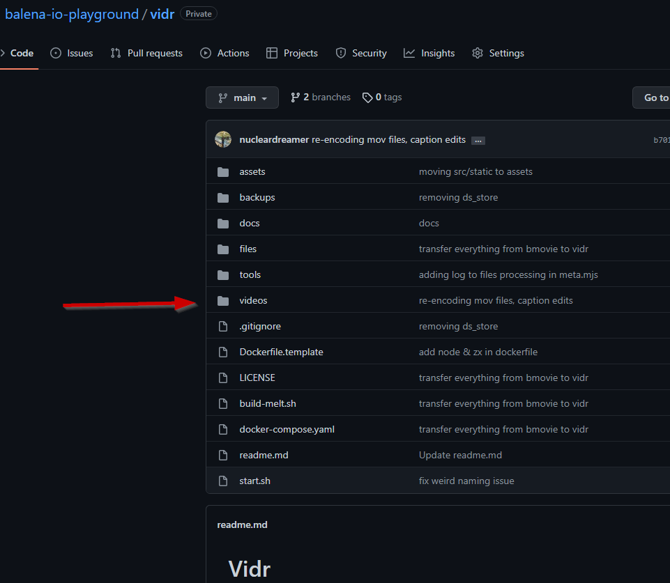
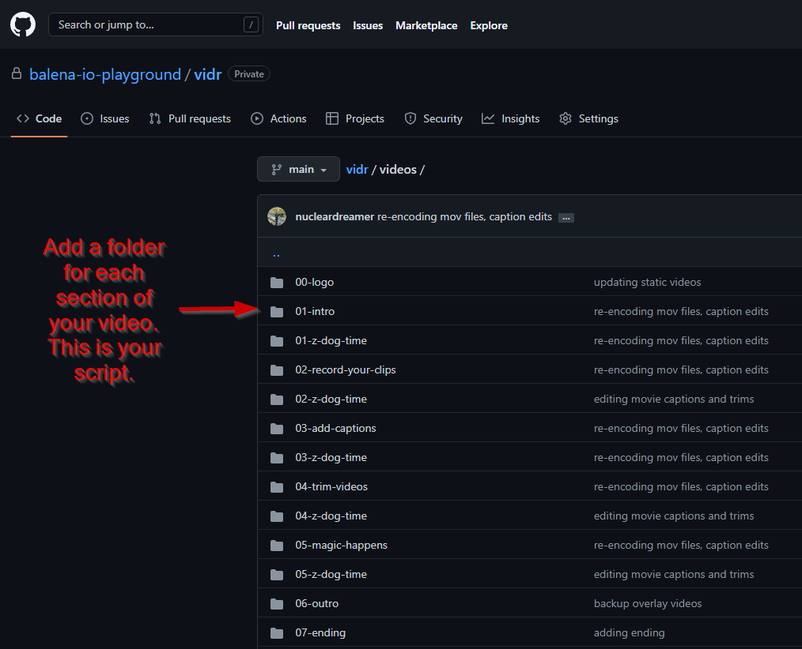
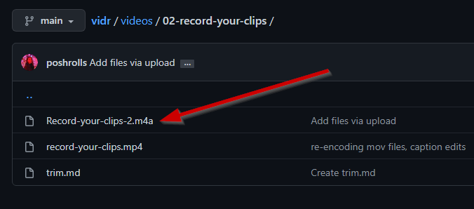
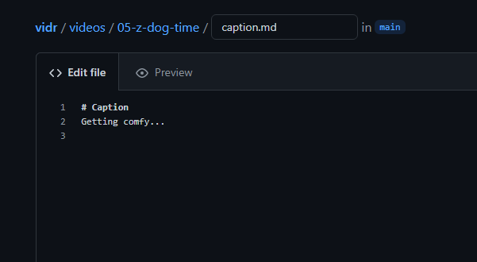

# Vidr
Landr only for product videos!
Enable product builders to create beautiful videos by simply putting their raw content alongside their source code.
vidr will clean it up, trim it, overlay audio, add gorgeous captions and create a smash hit product video.

## The Problem
Recording videos on a phone, webcam or by screen capture is easy. Editing videos so that they don't look crap is HARD. Not to mention boring. Busy product builders don't have the time or energy (and sometimes skills or software) to make videos about all their products. 

## vidr == the solution
With vidr product builders can capture video content, and add it to the same github repository as any of their other product files. They can also add audio files, to add background music or a clean audio commentary, which will be overlaid on top of the clip. And they can also add some simple markdown files, with a naming convention, to tell vidr to perform operations on each clip.
All of the edited clips will then be joined together in the correct order, and a top notch product video produced.

# How do I use it?
## Record your video sections
Simply record the sections of your video and add them to a landr-style folder structure:

## (Optional) Add audio files
Want some background music, or a clean voiceover explaining what's happening on the screen? Simply add the audio file next to the clip, and vidr will make it so:

For instance a 'caption.md' file will cause the text in that file to be overlaid on top of the clip, in a beautiful dynamic caption.

## (Optional) Add captions
Want some text overlaid on top of a clip, to make a cool segway scene? Sure, just add a `caption.md` file:

and vidr will do the rest!

https://user-images.githubusercontent.com/39430324/167104079-b9d332b4-c7db-45dd-a6d2-17aa4a829960.mp4

